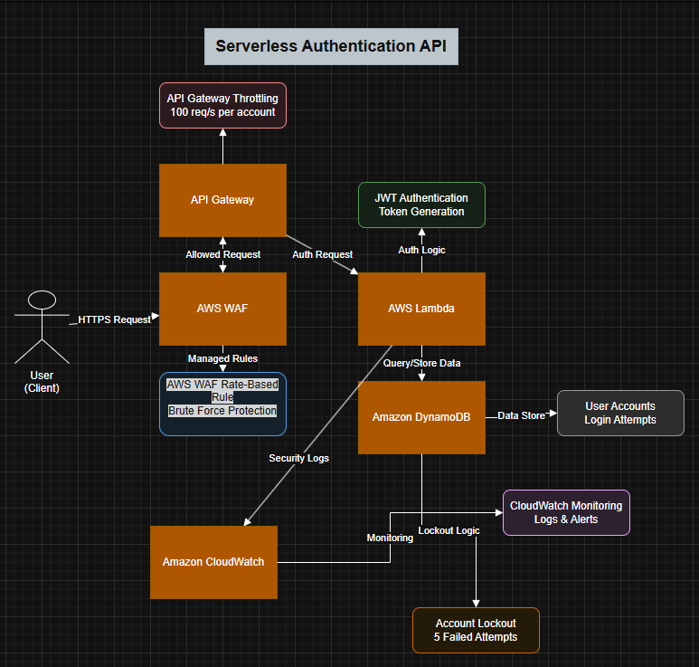
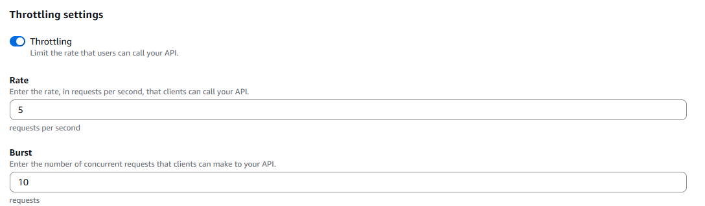
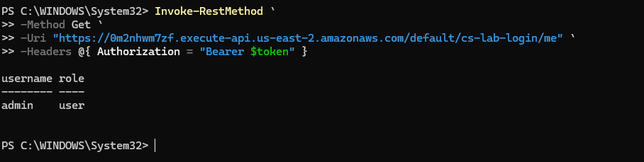

# AWS Secure Login Lab

A serverless authentication system built on AWS demonstrating how to implement security controls against brute-force attacks and API abuse.

This lab simulates a login API protected with multiple defensive layers including rate limiting, WAF rules, and account lock mechanisms.

---

# Architecture

Flow:

Client → API Gateway → WAF → Lambda → DynamoDB → CloudWatch

---

# Technologies Used

AWS Lambda
Amazon API Gateway
Amazon DynamoDB
AWS WAF
AWS IAM
Amazon CloudWatch

---

# Security Controls Implemented

### Password Hashing

Passwords are hashed using SHA-256 before validation.

---

### Brute Force Protection

After multiple failed login attempts the account is temporarily locked.

---

### Rate Limiting

API Gateway throttling limits request rates.

Example configuration:

---

### Web Application Firewall (WAF)

AWS WAF protects the API from common attacks.

Features enabled:

• Rate-based blocking
• Managed rule sets
• IP reputation filtering

Example rule:

---

### JWT Authentication

After successful login the system issues a JWT token used to access protected endpoints.

Example request:

---

# Attack Simulation

The system detects brute-force attempts through failed login monitoring and locks accounts when the threshold is exceeded.

---

# Threat Model

See the full threat model in:

/docs/threat-model.md

---

# Lessons Learned

• Implementing authentication in serverless environments
• Applying rate limiting and WAF protections
• Designing security controls against brute-force attacks
• Logging and monitoring security events in AWS
