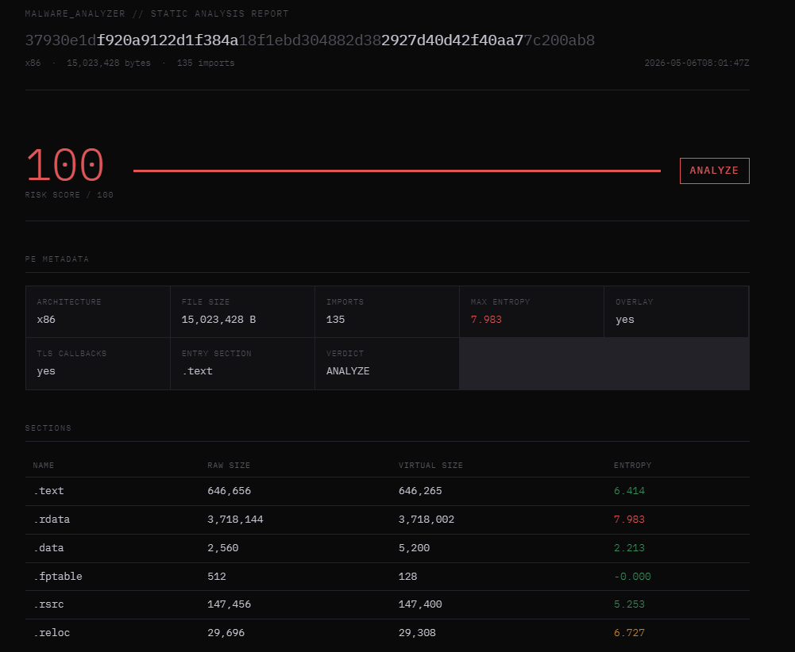

# malware_analyzer

Static malware analysis pipeline. Rule-based heuristics → local MITRE ATT&CK lookup → YARA generation. Zero LLM calls on the critical path. Zero cost.



---

## The problem with typical static analysis workflows

Most pipelines feed an import table to an LLM and trust the output. The LLM sees `CreateRemoteThread` and says *"Process Injection — T1055"*. Confident. Wrong half the time.

`CreateRemoteThread` alone means nothing. Legitimate software uses it. The technique only becomes evidence when it appears as part of a specific sequence: `VirtualAllocEx → WriteProcessMemory → CreateRemoteThread` — in that order, in that binary.

This pipeline enforces that discipline at every layer.

---

## Architecture

```
Binary
  │
  ├─ extractor.py ──── PE parsing, import table, strings, entropy per section
  │
  ├─ heuristic.py ──── Rule-based API sequence detection (no LLM)
  │                    Entropy thresholds, overlay detection, TLS callbacks
  │                    Verdict: SKIP | ANALYZE + risk score 0–100
  │
  ├─ attck.py ─────── Local MITRE ATT&CK lookup (697 techniques, cached JSON)
  │                    No API calls. Deterministic. Maps sequence hits to TTPs.
  │
  ├─ yara_gen.py ───── YARA rule generation from confirmed evidence only
  │                    4 rule types: strings, API sequences, entropy, combined
  │
  └─ report.py ──────── HTML report generation
                        Risk score, TTPs, entropy bars, flagged strings, YARA
```

---

## Design decisions

**Rule-based before any inference.** The heuristic engine runs entirely on deterministic rules — API sequences, entropy thresholds, structural PE anomalies. No model touches the classification step. This eliminates hallucinated TTPs and produces evidence that can be audited line by line.

**Sequences, not individual APIs.** The engine matches API calls in relative order across the import table, not presence alone. `VirtualAllocEx` scores zero. `VirtualAllocEx → WriteProcessMemory → CreateRemoteThread` in sequence scores 40 and maps to `T1055.002`. This distinction is the core of why the heuristic doesn't over-classify.

**Local ATT&CK database.** MITRE publishes the full ATT&CK Enterprise dataset as a JSON file. The pipeline downloads it once (~10MB), caches it locally, and performs all lookups offline. No API key, no rate limits, no cost.

**YARA from evidence, not from guesses.** Rules are generated only from artifacts confirmed by the heuristic layer. A single-API rule requires an entropy condition to reduce false positives. A combined rule requires at least 3 independent signals simultaneously.

**SKIP is a valid outcome.** Heavily packed samples like AgentTesla return `SKIP` with `risk_score=10`. That's correct behavior — static analysis is blind to packed payloads. Flagging it as malicious without evidence would be noise.

---

## Results on real samples

| Sample | Family | Verdict | Risk | TTPs confirmed |
|--------|--------|---------|------|----------------|
| `2d97b013...` | AgentTesla | SKIP | 10 | — (fully packed, no visible surface) |
| `37930e1d...` | SalatStealer UPX | ANALYZE | 100 | T1027.007, entropy 7.983, overlay, TLS |
| `a12ad896...` | AsyncRAT | ANALYZE | 100 | T1027.007, overlay, TLS, anti-debug |

Samples sourced from [MalwareBazaar](https://bazaar.abuse.ch). Never commit malware to repositories.

---

## Installation

```bash
git clone https://github.com/yourusername/malware-analyzer.git
cd malware-analyzer
pip install -r requirements.txt --break-system-packages
```

**Requirements:**
- Python 3.10+
- Kali Linux or any Debian-based distro (recommended)
- YARA installed: `sudo apt install yara`

First run downloads the ATT&CK Enterprise JSON (~10MB) and caches it in `data/`.

---

## Usage

```bash
python3 analyze.py <binary.exe>
```

**Output files** (written to `output/`):

| File | Contents |
|------|----------|
| `<sha256[:12]>_report.html` | Full HTML report |
| `<sha256[:12]>_report.json` | Machine-readable JSON |
| `<sha256[:12]>.yar` | Generated YARA rules |

---

## Pipeline output example

```
[+] Analyzing: sample.exe
============================================================
[1/5] Extracting PE artifacts...
    SHA256 : 37930e1df920a9122d1f...
    Arch   : x86
    Size   : 15,023,428 bytes
    APIs   : 135 imported
    Strings flagged: 1

[2/5] Running rule-based heuristics...
    Verdict    : ANALYZE
    Risk score : 100/100
    → dynamic_api_resolution [T1027.007] (MEDIUM)
    [entropy] .rdata: 7.983 — probable packing or encryption
    [note] PE has overlay — possible dropper or appended payload
    [note] TLS callbacks present — code runs before entry point

[3/5] Resolving TTPs against local ATT&CK database...
[4/5] Generating YARA rules...
[5/5] Generating HTML report...

[+] JSON   : output/37930e1df920_report.json
[+] YARA   : output/37930e1df920.yar
[+] HTML   : output/37930e1df920_report.html
    Risk   : 100/100 — ANALYZE
```

---

## YARA rule types generated

**Strings rule** — targets specific suspicious strings found in the binary (IPs, registry keys, mutexes). Condition: at least half of the identified strings must be present.

**API sequence rule** — targets the confirmed API sequence. Single-API rules require an entropy condition to limit false positives. 3+ API sequences are treated as high specificity.

**Entropy/packing rule** — uses YARA's `math.entropy()` to detect packed or encrypted sections. Combined with overlay and import count conditions.

**Combined rule** — requires at least 3 independent signals simultaneously (entropy + overlay + anti-debug + confirmed APIs). Lowest false positive rate of the four types.

---

## Known limitations

**Packed samples.** Static analysis cannot see imports or strings inside a packed payload. Heavily obfuscated samples like AgentTesla (1 visible import, low entropy) return SKIP. Unpacking requires dynamic analysis or manual unpacking before running the pipeline.

**Dynamic API resolution.** Malware that resolves all APIs at runtime via `GetProcAddress` will not trigger API sequence rules, because the imports are never in the table. The pipeline detects this pattern as `T1027.007` but cannot identify the underlying techniques.

**Import order dependency.** The sequence matcher relies on the order of entries in the PE import table. Some linkers and obfuscators reorder imports unpredictably, which can cause sequences to miss.

**No dynamic analysis.** This is intentionally a static-only pipeline. It does not execute, emulate, or sandbox the binary. Behavioral analysis requires a separate layer.

---

## Project structure

```
malware_analyzer/
├── core/
│   ├── __init__.py
│   ├── extractor.py      # PE parsing and artifact extraction
│   ├── heuristic.py      # Rule-based detection engine
│   ├── attck.py          # Local MITRE ATT&CK lookup
│   ├── yara_gen.py       # YARA rule generation
│   └── report.py         # HTML report generation
├── analyze.py            # Pipeline entry point
├── requirements.txt
└── .gitignore
```

`data/` and `output/` are created automatically on first run. Never committed.

---

## Roadmap

- [ ] Automatic UPX unpacking before analysis
- [ ] Ghidra headless integration for decompiled pseudocode
- [ ] Ollama integration for narrative generation (local, zero cost)
- [ ] Batch mode: analyze entire directories
- [ ] STIX 2.1 export for threat intelligence sharing

---

## References

- [MITRE ATT&CK Enterprise](https://attack.mitre.org/)
- [MalwareBazaar](https://bazaar.abuse.ch)
- [pefile](https://github.com/erocarrera/pefile)
- [YARA documentation](https://yara.readthedocs.io)
- [Vulhub](https://github.com/vulhub/vulhub)